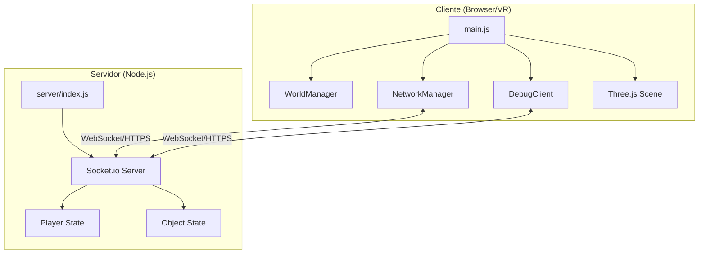
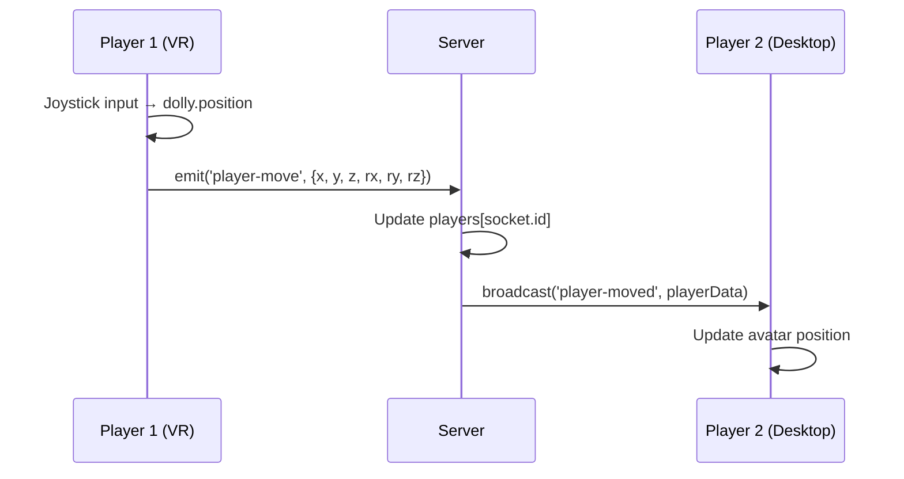
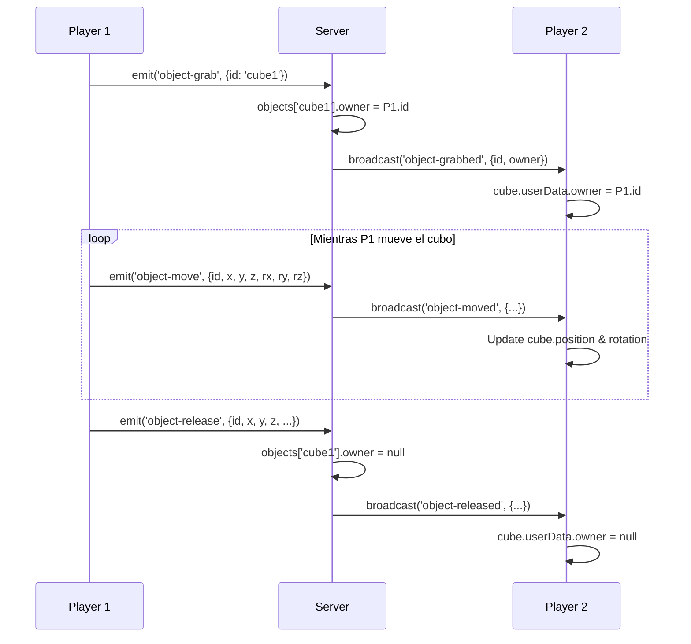

# Architecture Documentation - v0.0.1

## Overview

Este proyecto es un **Juego VR Multijugador** construido con Three.js y WebXR, utilizando una arquitectura Cliente-Servidor con Socket.io para sincronización en tiempo real.

## Arquitectura General



## Patrones de Diseño

### 1. **Event-Driven Architecture (Observer Pattern)**

**Ubicación:** NetworkManager, DebugClient, server/index.js

El sistema de red utiliza el patrón Observer mediante Socket.io para la comunicación bidireccional:

```javascript
// Cliente subscribe a eventos del servidor
socket.on('player-moved', (data) => { /* update avatar */ });

// Cliente emite eventos al servidor
socket.emit('player-move', playerData);

// Servidor broadcast a otros clientes
socket.broadcast.emit('player-moved', playerData);
```

**Beneficios:**
- Desacoplamiento entre cliente y servidor
- Comunicación asíncrona
- Fácil adición de nuevos eventos

### 2. **Component-Based Architecture**

**Ubicación:** main.js, WorldManager, NetworkManager

Cada módulo tiene una responsabilidad única:

- **main.js**: Controlador principal, loop de rendering
- **WorldManager**: Gestión del mundo infinito (chunks)
- **NetworkManager**: Sincronización multijugador
- **DebugClient**: Sistema de depuración remota

**Beneficios:**
- Código modular y reutilizable
- Fácil testing y mantenimiento
- Separación de preocupaciones (SoC)

### 3. **State Synchronization Pattern**

**Ubicación:** NetworkManager <-> server/index.js

Estado autoritativo en el servidor con reconciliación en cliente:

```javascript
// Servidor mantiene el estado autoritativo
const players = {};
const objects = { 'cube1': { owner: null, x, y, z, ... } };

// Cliente envía intención
socket.emit('object-grab', { id: 'cube1' });

// Servidor valida y broadcast
if (objects[id].owner === null) {
    objects[id].owner = socket.id;
    socket.broadcast.emit('object-grabbed', { id, owner });
}
```

**Beneficios:**
- Previene trampas/cheating
- Estado consistente entre clientes
- El servidor es la fuente de verdad

### 4. **Lazy Loading / Chunk System**

**Ubicación:** WorldManager

Generación procedural de terreno con carga/descarga dinámica:

```javascript
update(playerPosition) {
    const playerChunkX = Math.floor(playerPosition.x / chunkSize);
    // Generar chunks cercanos
    // Eliminar chunks lejanos
}
```

**Beneficios:**
- Rendimiento optimizado (no renderizar todo el mundo)
- Escalable a mundos muy grandes
- Uso eficiente de memoria

### 5. **Dolly Pattern (VR Locomotion)**

**Ubicación:** main.js

Container pattern para movimiento de cámara en VR:

```javascript
dolly = new THREE.Group();
dolly.add(camera);
dolly.add(controller1);
dolly.add(controller2);
// Mover el dolly mueve todo el "cuerpo" del jugador
dolly.position.add(movement);
```

**Beneficios:**
- Movimiento coherente de cámara + controladores
- Evita desincronización entre headset y manos
- Estándar en desarrollo VR

## Estructura del Proyecto

```
exploring_3D/
├── public/
│   └── grass.png                    # Textura del suelo
├── server/
│   └── index.js                     # Servidor Socket.io (HTTPS)
├── src/
│   ├── main.js                      # Punto de entrada, escena Three.js
│   ├── world-manager.js             # Generación de chunks
│   ├── network-manager.js           # Sincronización multijugador
│   ├── debug-client.js              # Cliente de debug remoto
│   └── config.js                    # Configuración (URLs, etc.)
├── admin.html                       # Panel de administración/debug
├── vite.config.js                   # Config Vite + HTTPS
├── GEMINI.md                        # Notas del proyecto
└── ARCHITECTURE.md                  # Este archivo
```

## Flujo de Datos

### Movimiento de Jugador



### Sincronización de Objetos



## Protocolo de Red (Socket.io Events)

### Player Events

| Evento | Dirección | Payload | Descripción |
|--------|-----------|---------|-------------|
| `current-players` | S→C | `{socketId: playerData, ...}` | Estado inicial de todos los jugadores |
| `player-joined` | S→C | `{id, x, y, z, rx, ry, rz, color}` | Nuevo jugador conectado |
| `player-move` | C→S | `{x, y, z, rx, ry, rz}` | Posición/rotación del jugador |
| `player-moved` | S→C | `{id, x, y, z, rx, ry, rz}` | Otro jugador se movió |
| `player-disconnected` | S→C | `socketId` | Jugador desconectado |

### Object Events

| Evento | Dirección | Payload | Descripción |
|--------|-----------|---------|-------------|
| `current-objects` | S→C | `{objectId: objectData, ...}` | Estado inicial de objetos |
| `object-grab` | C→S | `{id}` | Jugador agarra objeto |
| `object-grabbed` | S→C | `{id, owner}` | Objeto agarrado por alguien |
| `object-move` | C→S | `{id, x, y, z, rx, ry, rz}` | Objeto siendo movido |
| `object-moved` | S→C | `{id, x, y, z, rx, ry, rz}` | Objeto movido por otro |
| `object-release` | C→S | `{id, x, y, z, rx, ry, rz}` | Jugador suelta objeto |
| `object-released` | S→C | `{id, x, y, z, rx, ry, rz}` | Objeto soltado |

### Debug Events

| Evento | Dirección | Payload | Descripción |
|--------|-----------|---------|-------------|
| `identify` | C→S | `'game' \| 'admin'` | Identificar tipo de cliente |
| `log` | C→S | `{level, message}` | Enviar log al admin |
| `log` | S→C | `{level, message}` | Reenviar log a admin panel |
| `command` | C→S | `string` | Comando JS desde admin |
| `command` | S→C | `string` | Ejecutar comando en cliente |

## Tecnologías Clave

### Frontend
- **Three.js**: Rendering 3D y escena
- **WebXR**: API para VR (Quest)
- **Socket.io-client**: Cliente WebSocket
- **Vite**: Build tool y dev server
- **vite-plugin-mkcert**: HTTPS local (requerido por WebXR)

### Backend
- **Node.js**: Runtime del servidor
- **Express**: Framework web (opcional, solo para HTTPS server)
- **Socket.io**: WebSocket server
- **HTTPS**: Protocolo seguro (requerido por WebXR)

## Decisiones de Diseño

### ¿Por qué Socket.io sobre WebRTC?
- **Simplicidad**: Socket.io es más fácil de configurar para estado compartido
- **Servidor autoritativo**: Necesitamos un servidor central para validar acciones
- **Escalabilidad futura**: Más fácil añadir lógica de juego en servidor
- **Baja latencia no crítica**: Para 2-4 jugadores, Socket.io es suficiente

### ¿Por qué HTTPS en desarrollo?
- **WebXR Requirement**: Los navegadores solo permiten WebXR en contextos seguros (HTTPS)
- **Solución**: `vite-plugin-mkcert` genera certificados autofirmados locales

### ¿Por qué Dolly Group?
- **Estándar VR**: Es el patrón estándar para locomotion en WebXR
- **Coherencia**: Mantiene cámara y controladores sincronizados
- **Flexibilidad**: Permite diferentes métodos de locomoción (teleport, smooth, etc.)

## Extensibilidad Futura

### Fácil de añadir:
- ✅ Más objetos interactuables (ya hay patrón)
- ✅ Más tipos de eventos de red
- ✅ Diferentes tipos de terreno (modificar WorldManager)
- ✅ NPCs (crear avatares sin socket.id)

### Requiere refactoring:
- ❌ Más de ~10 jugadores simultáneos (necesitaría optimización de red)
- ❌ Físicas complejas (necesitaría motor de físicas como Cannon.js)
- ❌ Persistencia de mundo (necesitaría base de datos)
- ❌ Autenticación de usuarios (actualmente anónimo)

## Notas de Rendimiento

- **Throttling de red**: Player updates se envían cada ~50ms, no cada frame
- **Chunk culling**: Solo se renderizan chunks en un radio de `renderDistance`
- **Shared geometries**: WorldManager reutiliza geometría para todos los chunks
- **Broadcast selectivo**: `socket.broadcast` no envía al remitente

## Seguridad

⚠️ **Estado actual (v0.0.1)**: No hay validación de seguridad.

**Vulnerabilidades conocidas:**
- Cliente puede enviar cualquier posición de objeto
- No hay rate limiting
- No hay autenticación
- Certificados autofirmados (solo desarrollo)

**Para producción se necesitaría:**
- Server-side validation de movimientos
- Rate limiting en eventos
- Sistema de autenticación
- Certificados SSL válidos
- Anti-cheat básico

---

**Versión:** 0.0.1  
**Última actualización:** 2025-11-20  
**Desarrollado con:** Meta Quest + Antigravity (Gemini 3 Pro / Claude 4.5 Sonnet)
